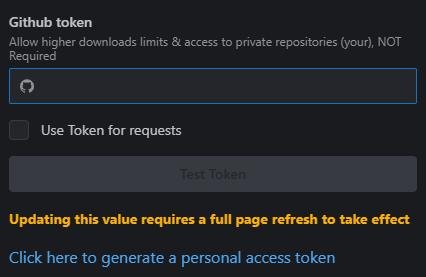
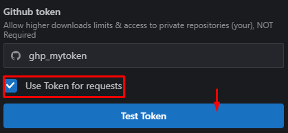

# 📂 download-github-files

Download **Individual** 📂 Directories from github. By default github only allows you to download the whole repository. This becomes a issue when you are trying to download
only a small portion of the repository of a large repository. This tool allows you to download what you need and even filter out the files you will download with [globs](https://en.wikipedia.org/wiki/Glob_(programming)) (Note only available with [downloader mode **1**](#downloader-modes))

# ✨ Features

* Elegant ui powered by [mantine](https://mantine.dev) 💻
* [Control panel to customize your experience](#⚙️-settings-panel-overview) ⚙️
* Fast downloads ⚡️
* Filter and only download the files you need ([Supported only with downloader mode **1**](#downloader-modes)), powered by [minimatch](https://github.com/isaacs/minimatch/tree/main)
* Automatic zip file generation 📦
* Support downloading of private repositories ([*](#limitation-on-private-repositories)) 🔒
* Download large directories 📂

# 

# 🚀 Demo

Click on any of the demo links to try it out.

* [Download one file](https://typicalninja493.github.io/download-github-files/d?resolve=https://github.com/typicalninja493/download-github-files/blob/main/readme.md)
* [Download With Nested Directories](https://typicalninja493.github.io/download-github-files/d?resolve=https://github.com/typicalninja493/tweets.ts/tree/main/docs)
* [Download of large amount of files](https://typicalninja493.github.io/download-github-files/d?resolve=https://github.com/umami-software/umami/tree/master/public/images/flags)

# ⚙️ Settings Panel overview

### Github token

The downloader requires a personal access token to be added to the settings panel to view private repositories. this also allows you to have **Higher** api limits.

> [Click here to generate a personal access token](https://github.com/settings/tokens/new?description=Download%20Github%20Files&scopes=repo)

> [Fine grained access tokens also work](https://github.com/settings/tokens?type=beta)

After generating a token, paste the token into the input, make sure "Use Token for requests" is ticked and click Test token

If all is good following notification should appear (if not check if you mistyped)

### Downloader Modes

There are currently 3 Downloader modes,

1. Fetch repo and file list - Give the full control to you, the downloader will only fetch the repo and file list and wait for you to click "fetch..." button to continue

2. Fetch repo and Download Files - One step further than 1st mode. on this mode the downloader will download and keep the zip file in memory instead of prompting for saving

3. Fetch repo and Download & Save Files - Download will start on visiting the site and save prompt will appear automatically

# ⚠️ Limitations

### API Limits

* This tool utilizes the GitHub API to retrieve file lists and their content. As with any API, there are limits. By default, the tool operates in ****Guest** mode, which may have lower API limits.

* If you desire a higher API limit, [create a GitHub personal token](https://github.com/settings/tokens/new?description=Download%20Github%20Files&scopes=repo) and 
[add it to the settings panel](#github-token) of the downloader. **Remember to refresh the page** after adding the token.

* For large repositories this api will try to download the content via a different strategy due to api limitation, however the amount of files downloaded may vary (it may also cost more in resources)

### Limitation on Private Repositories

* The downloader requires a personal access token to be [added to the settings panel]((#settings-panel-overview)) to view any private repository

> [Click here to generate a personal access token](https://github.com/settings/tokens/new?description=Download%20Github%20Files&scopes=repo)

> [Fine grained access tokens also work](https://github.com/settings/tokens?type=beta)

# Credits

### Packages used

* [react](https://react.dev/)
* [mantine ui](https://mantine.dev) - ui
* [fflate](https://github.com/101arrowz/fflate) - Zip file creation
* [save-file](https://github.com/dy/save-file)  - Save file in browser
* [p-map & p-retry](https://github.com/sindresorhus/p-map) - promise based stuff
* [minimatch](https://github.com/isaacs/minimatch/tree/main) - use in the filter to check file path with glob support

### Inspiration

* [download-directory.github.io](https://download-directory.github.io) - Direct Inspiration for this project

# License

GNU General Public License v3.0 or later

See [LICENSE](./LICENSE) to see the full text.
